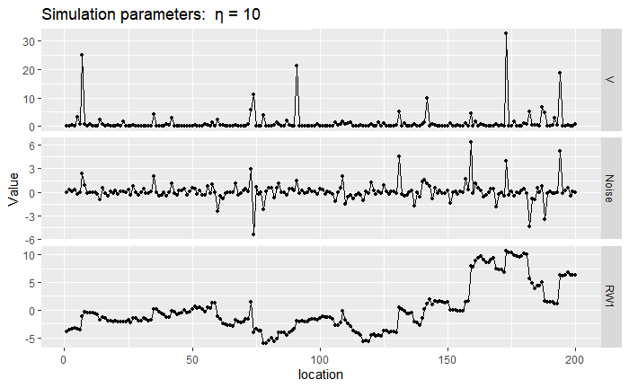

# Theoretical background

## NIG distribution

Instead of considering a Gaussian driving noise for the stochastic processes, we will use the NIG distribution, which is a more flexible distribution, allowing for exponential tails and asymmetry. The common parameterization of the NIG distribution has 4 parameters ($\mu$, $\delta$, $\alpha$, $\beta$) and the following pdf:

$$
\pi(x) = \frac{\alpha \delta K_{1}\left(\alpha \sqrt{\delta^{2}+(x-\mu)^{2}}\right)}{\pi \sqrt{\delta^{2}+(x-\mu)^{2}}} e^{\delta \gamma+\beta(x-\mu)},
$$

where $\gamma= \sqrt{\alpha^2-\beta^2}$, and $K_\nu(x)$ is the modified Bessel function of the second kind. A NIG random variable $\Lambda$ can be represented as a Normal variance-mean mixture:
$$
\Lambda|V \sim N(\mu+ \beta V , V) \\ 
 V \sim IG(\delta,\gamma),
$$
where IG stands for the Inverse-Gaussian distribution.

This representation is useful for sampling and is also the basis for Bayesian and maximum likelihood estimation (see @bolin2014spatial and @walder2020bayesian) since the normal variance-mean mixture shares many of the convenient properties of the Gaussian distribution.

## New parameterization

### Mean-scale invariant parameterization ($\eta$, $\zeta$)


In the previous parameterization, the location ($\mu$) and scale ($\delta$) parameters do not correspond to the mean and standard deviation of the distribution, which also depends on $\alpha$ and $\beta$. In @cabral2022controlling we propose a "mean-scale" invariant parameterization where the mean and the standard deviation are fixed. This not only eases interpretation but also allows assigning the priors for the mean and scale of the Gaussian model in non-Gaussian models, which is very convenient when implementing these non-Gaussian models in practice. The mixture representation belonging to this parameterization is:


\begin{equation}
\Lambda|V \sim N\left(\zeta \tilde{\sigma}(V-1), \ \ \tilde{\sigma}^2V\right), \ \ \ \ \tilde{\sigma} = \frac{1}{\sqrt{1+\eta \zeta^2}}, \\
V \sim IG(1,\eta^{-1})
(\#eq:noise0)
\end{equation}

The mean and variance are always $0$ and $1$, respectively. The parameter $\eta$ is related to the degree of non-Gaussianity since $\Lambda$ converges to a Gaussian random variable when $\eta \to 0$, and to a Cauchy random variable when $\eta \to \infty$. The parameter $\zeta$ is related to the asymmetry of the random variable since $\Lambda$ is a symmetric random variable when $\zeta=0$, and when $\zeta>0$ it is skewed to the right. Also, the larger $\eta$, the larger the asymmetry induced by the same value of $\zeta$ (see following plots).

```{r NIGplot, fig.cap="PDF of NIG distribution in log scale", out.width = '100%'}
knitr::include_graphics("files/images/NIGplot.png")
```


### Standardized and orthogonal parameterization ($\eta^\star$, $\zeta^\star$)

There is still some confounding between $\eta$ and $\zeta$ in the standardized parameterization since the excess kurtosis increases with $\zeta$. We find the kurtosis to be hard to interpret (it is not clear what an increase in kurtosis of 1 means in practice) and so we prefer to associate $\eta$ with the likelihood of large events. For the NIG distribution this probability can be approximated by \mbox{$P(|\Lambda|>x) \propto x^{-3/2} \exp(-\eta^{-1/2} \xi_{NIG} x)$} for large $x$ \citep{hammerstein2016tail}. The dependency of this probability with the skewness parameter $\zeta$ comes through the rate $\xi$:
$$\xi = 1+\zeta^2\eta - |\zeta|\sqrt{\eta(1+\zeta^2\eta)},$$
which is equal to 1 in the symmetric case ($\zeta=0$). @cabral2022controlling required the probability $P(|\Lambda|>x)$ to be invariant with the skewness parameter, at least for large $x$. This can be achieved by the parameter transformations $\eta^\star = \eta\xi_{NIG}^{-2}$ and $\zeta^\star = \zeta\sqrt{\eta}$. This parameterization has an orthogonal interpretation since the likelihood of large events and the excess Kurtosis now only depend on $\eta^{\star}$.


## Framework for extending Gaussian models

### Illustration with the RW1 process

Here we show how a random walk of order 1 (RW1) process with irregularly spaced locations can be extended to non-Gaussianity. It is quite a simple model, but it serves as a good illustration since the same procedure applies to more complex models. Consider a set of $n$ locations $s_1,\dotsc, s_n$, where the distance between locations is $h_i=s_{i+1}-s_i$. When the driving noise is Gaussian, we assume $x_{i+1}-x_i \overset{d}{=} \sigma Z_i$, where $Z_i \sim N(0,h_i)$. Notice that the RW1 model can be seen as an approximation of a Wiener process.  In our non-Gaussian setting, we replace the standard Gaussian noise $Z_i$ with standardized non-Gaussian noise $\Lambda_i$, so we assume that $x_{i+1}-x_i \overset{d}{=} \sigma\Lambda_i$, where $\Lambda_i$ follows:

\begin{equation}
\Lambda_i|V_i \sim N\left(\zeta \tilde{\sigma}(V_i-h_i), \ \ \tilde{\sigma}^2V_i\right), \ \ \ \ \tilde{\sigma} = \frac{\sigma}{\sqrt{1+\eta \zeta^2}} \\
V_{i} \overset{ind.}{\sim} IG(h_i,\eta^{-1} h_i^2)   \\
(\#eq:noise)
\end{equation}

where $E[\Lambda_i]=0$ and $Var[\Lambda_i]=h_i$. For the analytically inclined, this RW1 model is an approximation of a Lévy process $L(t)$ where an increment of size 1 follows the NIG distribution. Speaking only of essential terms, a Lévy process is a process with independent and stationary increments, and all finite-dimensional distributions are known if we know the distribution of an increment (more about Lévy processes in @ken1999levy and @barndorff2012levy). If the increments are Gaussian then $L(t)$ is a Gaussian process, while in general, it is non-Gaussian. <!--The parameterization ($\eta^\star$,$\zeta^\star$) also depends now on a predefined vector $\mathbf{h}$, which contains the distance between locations.-->

Next, we show a sample path of RW1 with $\sigma=1$ near the Gaussian case by setting $\eta=10^{-6}$ (top) and a non-Gaussian case by setting $\eta=10$ (bottom). We generated these simulated paths by first sampling the mixing variables $V_i$, then sampling the noise $\Lambda_i|V_i$, and then the RW1 sample paths are just a cumulative sum of the noises $\Lambda_i$. Notice that, in the first panel, the mixing variables $V_i$ are very close to 1 while on the bottom panel there is more discrepancy. When $V_i$ takes a large value, the noise $\Lambda$ can also be large and then we observe a large jump in the RW1 process driven by NIG noise.

```{r, out.width = '100%', fig.cap="Sample of mixing vector $\\mathbf{V}$, noise vector $\\mathbf{\\Lambda}$ and RW1 vector $\\mathbf{x}$."}
knitr::include_graphics("files/images/GaussRW1.png")
```

```{r, out.width = '100%', fig.cap="Sample of mixing vector $\\mathbf{V}$, noise vector $\\mathbf{\\Lambda}$ and RW1 vector $\\mathbf{x}$."}

```

### Models defined via $\mathbf{D}\mathbf{x} = \mathbf{Z}$

The system of equations seen before $x_{i+1}-x_i \overset{d}{=} \sigma Z_i$ defines the linear system $\mathbf{D}_{RW1}\mathbf{x}=\sigma\mathbf{Z}$, where $\mathbf{Z}$ is a vector of independent Gaussian noise, and:
$$
\mathbf{D}_{RW1} = \begin{pmatrix}
-1 & 1  &  & & \\
 & -1 & 1 & & \\
 & & \ddots  & \ddots &              \\
 & & & -1 & 1
\end{pmatrix}. 
$$

For a RW2 model it is assumed $x_{i+2}-2x_{i+1}+x_i = \sigma Z_i$, and for an autoregressive process of order 1 (AR1) the assumptions are that $\sqrt{1-\rho^2}x_1= \sigma Z_1$, and $x_{i+1}-\rho x_i = \sigma Z_i$ for $i>1$, where $\rho$ is the autocorrelation parameter. Thus, the matrices $\mathbf{D}_{RW2}$ and $\mathbf{D}_{AR1}$ are: 

$$
\mathbf{D}_{RW2} = \begin{pmatrix}
1 & -2  & 1 & & & \\
 & 1 & -2 & 1 & & \\
 \\
 & & & \ddots  & \ddots & \ddots   &           \\
 \\
 & & &  & & 1 & -2 & 1
\end{pmatrix}, \ \ 
\mathbf{D}_{AR1} = \begin{pmatrix}
\sqrt{1-\rho^2} &   &  & & & \\
-\rho & 1 &  &  & & \\
  & -\rho & 1 &  & & \\
 &  & \ddots & \ddots   & \\
 &  &  &  -\rho & 1
\end{pmatrix} 
$$
Likewise, higher-order AR processes can be constructed. The rows of the matrix $\mathbf{D}$ contain the "increments" that we assume to follow Gaussian noise. Other models fit in this framework, including intrinsic conditional autoregressive models and simultaneous autoregressive models which we will see later in the applications. The system $\mathbf{D}\mathbf{x} = \sigma\mathbf{Z}$ also appears when computing discrete-space approximation of stochastic processes defined via SPDEs: $\mathcal{D}X(t) = W'(t)$, where $\mathcal{D}$ is a linear differential operator and $W'(t)$ is a Gaussian noise process. For instance, stationary Matérn random fields and Ornstein–Uhlenbeck processes arise as stationary solutions to SPDEs. 


### Generic framework 

We have seen before that the linear system
$$
\mathbf{D}\mathbf{x}^G\overset{d}{=} \mathbf{Z},
$$
is a natural representation for many models, where the matrix $\mathbf{D}$ defines the model and $\mathbf{Z}$ is a vector of independent Gaussian noise: $Z_i \overset{i.i.d}{\sim} N(0,h_i)$, where $h_i$ is the distance between locations, for instance. The precision matrix of $\mathbf{x}$ is then $\mathbf{Q}\propto \mathbf{D}^T\text{diag}(\mathbf{h})^{-1}\mathbf{D}$, which for the examples we will study is sparse. The non-Gaussian extension consists in assuming:

$$
\mathbf{D}\mathbf{x}\overset{d}{=} \mathbf{\Lambda},
$$

where $\boldsymbol{\Lambda}$ is a vector of independent NIG noise as in eq. \@ref(eq:noise). A location and scale parameter can be added by the usual transformation $\mu + \sigma\mathbf{x}$. Consider the vector $\mathbf{V}=[V_1,V_2, \dotsc, V_n]^T$. If $\mathbf{D}$ is a full rank matrix, then $\mathbf{x}$ has the representation:
 
\begin{equation}
\mathbf{x}|\boldsymbol{V} \sim N\left(\tilde{\sigma}\zeta \mathbf{D}^{-1}(\boldsymbol{V}-\boldsymbol{h}), \ \ \tilde{\sigma}^2 \mathbf{D}^{-1}\text{diag}(\boldsymbol{V})\mathbf{D}^{-T}\right)\\
V_{i} \overset{ind.}{\sim}  IG(h_i,\eta^{-1} h_i^2)   \\
(\#eq:framework)
\end{equation}

where $\mathbf{x}|\boldsymbol{V}$ is still a multivariate Gaussian distribution, but with precision matrix $Q=\tilde{\sigma}^{-2}\mathbf{D}^T \text{diag} ({\mathbf{V}})^{-1}\mathbf{D}$ with the same degree of sparsity as in the Gaussian case. Here it is important to mention that the precision or covariance matrices do not uniquely define the models, and these are only uniquely defined by the matrix $\mathbf{D}$. For instance, if we decompose the covariance matrix in two ways, $\Sigma = L_1 L_1^T$ and $\Sigma  = L_2 L_2^T$, then in the Gaussian case, the vectors $\mathbf{x_1}=\mathbf{L_1}\mathbf{Z}$ and $\mathbf{x_2}=\mathbf{L_2}\mathbf{Z}$ are equal in distribution. However, when the noise is non-Gaussian this is not the case. An example is shown in Fig. 2 of @DavidLinear, where stochastic processes with associated operators $\mathcal{D}_1=\kappa + \partial_t$, $\mathcal{D}_2 =\kappa^2- \partial_t^2$ have the same exponential covariance function, but when using a NIG noise process the sample paths behave differently. This limits the transformations we can do for computational efficiency because we are restricted to the model representation $\mathbf{D}\mathbf{x}=\mathbf{\Lambda}$.

### Sample paths

We look at different models that can be expressed through:
$$
\mathcal{D}X(t) =L'(t),
$$
where $\mathcal{D}$ is a linear differential operator and $L'(t)$ is a NIG noise process. The differential operator for different models is shown next, where OU stands for the Ornstein–Uhlenbeck process, which can be seen as the continuous version of an autoregressive process of order 1. In the third column, we consider the discrete case equivalents of these models, where the 'increments' are assumed to follow independent NIG noise.


Model              $\mathcal{D}$             Increments
-------            ------                    ----------  
RW1                $\partial_t$              $x_{i+1}-x_{i}$  
OU                 $\kappa + \partial_t$     $x_{i+1} + (\kappa-1)x_{i}$              
RW2                $\partial_t^2$            $x_{i} - 2x_{i+1} + x_{i+2}$
Matérn $\alpha=2$  $\kappa^2- \partial_t^2$  $(1+\kappa^2)x_{i} - 2x_{i+1} + x_{i+2}$


The first column of the next plot shows a simulation of Gaussian noise and the sample paths of several models generated from it. In the second column, we repeat the same, but now with non-Gaussian NIG noise. We can see that most NIG noise events are near 0, and a few of them take large values (larger than the ones you see in the Gaussian noise process) since the NIG distribution has heavier tails and is more peaked around 0. Whenever the noise takes a large value (for instance, near location 0.25), the RW1 and OU processes will exhibit a distinct jump, and the RW2 and Matérn processes will exhibit a kink (discontinuity in the first derivative). 


```{r, out.width = '100%', fig.cap="Noise and sample paths for several models"}
knitr::include_graphics("files/images/sim1.png")
```

Next, we show sample paths of a Matérn model in 2D driven with NIG driving noise, as described in @bolin2014spatial.  Notice that in Fig. \@ref(fig:compareSPDE) as $\eta$ increases we observe more "hotspots" and "coldspots", that is, regions where the field $X$ takes values that would be considered extreme in a Gaussian model. In the symmetric case ($\zeta = 0$) the number of hotspots and coldspots is on average the same, while if $\zeta > 0$ there should be on average more hotspots than coldspots.

```{r compareSPDE, out.width = '100%', fig.cap="Sample paths of a Matérn model in 2D with $\\alpha=2$"}
knitr::include_graphics("files/images/sim3.png")
```


## Penalized complexity priors for $\eta^\star$ and $\zeta^\star$

The non-Gaussian extension does not affect the mean and covariance structure of the model so we can reuse the same priors for the scale $\sigma$ and spatial range parameter $\kappa$ from the Gaussian model. Prior distributions for $\eta^\star$ and $\zeta^\star$ are constructed based on the penalized complexity (PC) priors approach (@simpson2017penalising) in @cabral2022controlling. PC priors tend to avoid overfitting by default because the mode of the prior distribution is located at the base model.

A useful result shown in @cabral2022controlling is that the PC priors for $\eta^\star$ and $\zeta^\star$ do not depend on the matrix $\mathbf{D}$ or the scale $\sigma$, so the prior distributions will be the same regardless of the model. The PC prior for $\eta^\star$ follows an exponential distribution and the PC prior for $\zeta^\star$ follow a Laplace distribution, each with a given rate parameter. This rate parameter can be found by relating $\eta^\star$ and $\zeta^\star$ with some interpretable properties of the model. For $\eta^\star$ we can study how many more large events the NIG noise has compared with the Gaussian noise: $Q(\eta^\star) = P(|\Lambda|>3)/P(|Z|>3)$, where $\Lambda$ and $Z$ are standardized NIG and Gaussian random variable. Then, $\eta^\star$ is found from the probability statement $P(Q(\eta^\star)>2)=\alpha$, where we set a low probability $\alpha$ that the NIG noise has twice as much large events as the Gaussian noise. A more detailed discussion on the PC priors for non-Gaussian models can be found in @cabral2022controlling


## Useful properties of the vector $\mathbf{x}$

In some examples we consider latent (non-Gaussian) models where the observations $\mathbf{y}$ depend on $\mathbf{x}$ through $\mathbf{y}|\mathbf{x} \sim N(\mathbf{B}\boldsymbol{\beta} + \sigma_x\mathbf{x},\sigma_y)$, where $\mathbf{B}$ is a design matrix, $\boldsymbol{\beta}$ are regression coefficients, and $\mathbf{x}$ is the non-Gaussian random vector usually added to model structured temporal or spatial effects.

Bayesian and maximum likelihood estimation of these models typically leverages the hierarchical representation in eq. \@ref(eq:framework). The precision matrix of $\mathbf{x}|\mathbf{V}$ is sparse, but to compute the mean of $\mathbf{x}|\mathbf{V}$ we need to invert the matrix $\mathbf{D}$, which can be expensive, especially if $\mathbf{D}$ depends on a parameter, since then this inversion needs to be done at every iteration. Furthermore, if we implement this representation directly on Stan, besides estimating, $\sigma_x$, $\eta^\star$, and $\zeta^\star$, we need an extra $2N$ parameters, since both $\mathbf{x}$ and $\mathbf{V}$ need to be estimated, where $N$ is the dimension of $\mathbf{x}$,

### Joint PDF of $\mathbf{x}$

By integrating out the auxiliary variables $V_i$ in eq. \@ref(eq:framework) we can basically cut the dimension of the parameter space being explored in Stan by almost half, which should lead to a significant speedup. This at first may seem complicated to do, but if we realize that $\mathbf{x} = \mathbf{D}^{-1}\mathbf{\Lambda}$ if $\mathbf{D}$ is non-singular, then the multivariate transformation method wields:
\begin{equation}
    \pi(\mathbf{x})= |\mathbf{D}|\prod_{i=1}^n\pi_{\Lambda_i}([\mathbf{D}\mathbf{x}]_i),
    (\#eq:joint)
\end{equation}

where $\pi_{\Lambda_i}$ is the PDF of a NIG distribution with parameters $\sigma$, $\eta^\star$ and $\zeta^\star$, and $h_i$ as in eq. \@ref(eq:noise). We can then do the estimation in Stan based on the previous joint density, where there is no need for the auxiliary vector $\mathbf{V}$ and no need of inverting the matrix $\mathbf{D}$. 


### Mixing distribution vector $\mathbf{V}$

The prior assumption on the mixing variables is $V_{i}|\eta \overset{ind.}{\sim}  IG(h_i,\eta^{-1} h_i^2)$. It can be shown that $V_{i} \to h_i$, in the Gaussian limit (when $\eta \to 0$). Therefore in the Gaussian limit $\mathbf{V}\oslash\mathbf{h}=\mathbf{1}$, where $\oslash$ performs the element-wise division. If $V_i/h_i$ has a high posterior mean, then the noise element $\Lambda_i$ is significantly non-Gaussian, and more flexibility is needed around time point or location $i$ that is not present in the Gaussian model (see Fig. \@ref(fig:RW1sample)). Thus, the posterior summaries of $E[\mathbf{V}\oslash\mathbf{h}]$ can be used as a diagnostic tool to inspect if and where departures from Gaussianity occur. It is easier to interpret than the posterior summaries of $\eta$, as the "non-Gaussianity" of $\mathbf{x}$ depends not only on $\eta$, but also on $\mathbf{D}$ (@cabral2022controlling).

After the estimation is completed using the joint PDF of eq. \@ref(eq:joint) we can generate samples of $\mathbf{V}|\mathbf{y}$ post-hoc using:

\begin{equation}
V_i|\mathbf{x},\tilde{\sigma},\eta,\zeta,h_i \sim GIG(-1,\eta^{-1} + \zeta^2,\eta^{-1}h_i^2 + ([\mathbf{D}\mathbf{x}]_i/\tilde{\sigma} + \zeta h_i)^2),
(\#eq:V)
\end{equation}

where $GIG(p, a,b)$ stands for the generalized inverse Gaussian distribution with pdf:

$$
\pi(x | p, a, b)=\frac{(a / b)^{p / 2}}{2 K_{p}(\sqrt{a b})} x^{p-1} \exp \left(-\frac{a}{2} x-\frac{b}{2} x^{-1}\right),\ \ x>0.
$$


