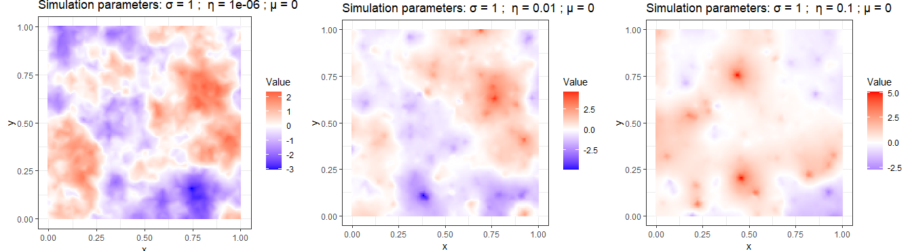

This repository contains the files of a Bookdown tutorial where I implement a generic class of non-Gaussian models in Stan: [https://rafaelcabral96.github.io/nigstan/sar-and-car-models.html](https://rafaelcabral96.github.io/nigstan/sar-and-car-models.html)

The tutorial introduces the non-Gaussian models I am studying, and how to implement them in Stan and contains 3 applications.

The Stan functions used to declare the non-Gaussian models can be found in files/functions.stan, and the Stan model declaration for the applications is in files/stan/.

