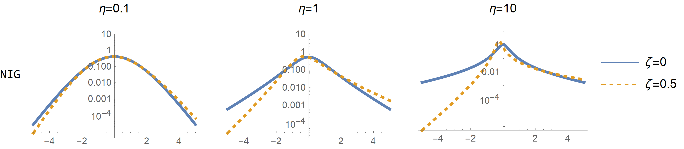
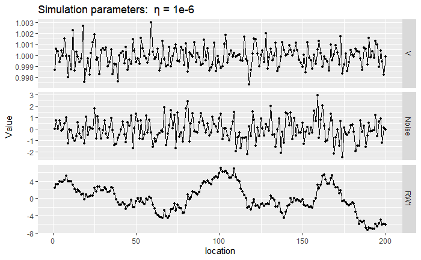

# Theoretical background

## NIG distribution

Instead of considering Gaussian driving noise for the stochastic processes, we will use the NIG distribution, which is a more flexible distribution, allowing for heavier tails and asymmetry. A common parameterization of the NIG distribution has 4 parameters ($\mu$, $\alpha$, $\beta$, $\delta$) and the following pdf:

$$
\pi(x) = \frac{\alpha \delta K_{1}\left(\alpha \sqrt{\delta^{2}+(x-\mu)^{2}}\right)}{\pi \sqrt{\delta^{2}+(x-\mu)^{2}}} e^{\delta \gamma+\beta(x-\mu)},
$$

where $\gamma= \sqrt{\alpha^2-\beta^2}$, and $K_\nu(x)$ is the modified Besse function of the second kind. A NIG random variable $\Lambda$ can represented as a Normal variance-mean mixture with IG (inverse Gaussian) as a mixing distribution:
$$
\Lambda|V \sim N(\mu+ \beta V , V) \\ 
 V \sim IG(\delta,\gamma),
$$

This representation is often used for sampling, and is also the basis for baeysian and maximum likelihood estimation (cite), since it shares many of the convenient properties of a Gaussian distribution.

## New parameterization

### Variance and mean correction

To avoid confounding with an intercept parameter we set $E[\Lambda]=0$. The variance of $\Lambda$ is $\delta \alpha^2/\gamma^3$. For better interpretability and estimation we also consider a parameterization where $Var[\Lambda]=\sigma^2$. This leads us to the following Normal variance-mean mixture representation:

\begin{equation}
\Lambda|V \sim N\left(\mu \tilde{\sigma}(V-1), \ \ \tilde{\sigma}^2V\right), \ \ \ \ \tilde{\sigma} = \frac{\sigma}{\sqrt{1+\eta \mu^2}}, \\
V \sim IG(1,\eta^{-1})
(\#eq:noise0)
\end{equation}

The parameter $\eta$ is related to the degree of non-Gaussianity since $\Lambda$ converges to a Gaussian random variable when $\eta \to 0$, and as we increase $\eta$, the heaviness of the tails increase. The parameter $\mu$ is related to the asymmetry of the random variable, since $\Lambda$ is a symmetric random variable when $\mu=0$, and when $\mu>0$ it is skewed to the right. Also, the larger $\eta$, the larger is the asymmetry induced by the same value of $\mu$ (see following plots).

```{r NIGplot, fig.cap="PDF of NIG distribution in log scale", out.width = '100%'}

```


### Tail correction {#Tailcorrection}

We consider another transformation of parameters, leading to the  $(\sigma, \eta^\star, \mu^\star)$ parameterization, which we explain after:

$$
\mu  \to \mu^\star / \sqrt{\eta}, \\
\eta \to \eta^\star (1 + \mu^{\star^2} - |\mu^\star|\sqrt{1 + \mu^{\star^2}})^2.        
$$

In line with @simpson2017penalising we view the NIG distribution as an extension of the more basic Gaussian distribution, in the sense that it contains the Gaussian distribution as a particular case and its flexibility is controlled by flexibility parameters, which are $\eta$ and $\mu$. Since there are two flexibility parameters, we view the NIG distribution as two consecutive extensions of the base Gaussian distribution. The first extension is between the base Gaussian distribution and the symmetric NIG distribution where the flexibility parameter is $\eta$. And the second extension is between the symmetric and assymetric NIG distributions, where the flexibility parameter is $\mu$.

When considering the second model extension with the added flexibility parameter $\mu$, we need to make sure that the old parameter $\eta$ still retains its meaning. The parameter $\eta$ can be related to the kurtosis of $\Lambda$ or the likelihood of large events $\beta_1 = P(|\Lambda|>3\sigma)$, while $\mu$ can be related to the skewness or the ratio $\beta_2 = P(\Lambda>3\sigma)/P(\Lambda<-3\sigma)$ which is different from 1 in the asymmetric case. However, the second flexibility parameter has an impact on the kurtosis and $\beta_1$. If we want the parameters $\eta$ and $\mu$ to be related to distinct and separate aspects of the noise we need to apply a correction.


The probabilities $\beta_1$ and $\beta_2$ are related to the behaviour of the tails of $\Lambda$ and from Fig. \@ref(fig:NIGplot) we can observe that for large events the log-densities behave linearly. $\beta_1$ is related to the tail of the distribution of $|\Lambda|$ where the log-likelihood has slope: 

$$
\alpha =\frac{1+\mu^2\eta - |\mu|\sqrt{\eta(1+\mu^2\eta)}}{\sigma\sqrt{\eta}} = \frac{1}{\sigma \sqrt{\eta^*}}
$$

The slope $\alpha$ is related to the excess kurtosis of $\Lambda$: $\alpha \approx 3 \times \text{Excess Kurtosis}[\Lambda]^{-1/2}$, so with the new parameterization $\mu$ has a minimal impact on the excess kurtosis which is now controled by $\eta^\star$ only: $ \text{Excess Kurtosis}[\Lambda]=3\eta^\star$. The probability $\beta_2$ is related to the asymmetry of the tails. If $\alpha_R$ and $\alpha_L$ are the slopes of the right and left tails then:

$$
\gamma = \frac{\alpha_L}{\alpha_R} = 1 + 2(\mu^2\eta + \mu\sqrt{\eta (1 + \mu^2 \eta)} = 1+2\left(\mu^{\star^2}+ \mu^\star\sqrt{1+\mu^{\star^2}}\right).    
$$

With the new parameterization, $\alpha$ only depends on $\eta^*$ and $\gamma$ only depends on $\mu^*$. There are several advantages of using the parameterization $(\sigma, \eta^\star, \mu^\star)$, instead of $(\sigma, \eta, \mu)$. First, the priors derived using the penalized complexity prior approach turn out to be quite simple: an exponential and Laplace distribution for $\eta^\star$ and $\mu^\star$, each one with a given rate parameter. Second, we noticed that the autocorrelations in the posterior samples between the first and second flexibility parameters lowered from about 40% to almost 0%, and the sampling times were lower for several models.


## Framework for extending Gaussian models

### Ilustration with the RW1 process

Here we show how a random walk of order 1 (RW1) process with irregularly spaced locations can be extended to non-Gaussianity. It is quite a simple model, but it serves as a good illustration since the same the procedure applies to more complex models. Consider a set of $n$ locations $s_1,\dotsc, s_n$, where the distance between locations is $h_i=s_{i+1}-s_i$. When the driving noise is Gaussian, we assume $x_{i+1}-x_i \overset{d}{=} Z_i$, where $Z_i \sim N(0,h_i\sigma^2)$. Notice that the RW1 model can be seen as an approximation of a Wiener process.  In our non-Gaussian setting, we replace the Gaussian noise $Z_i$ with non-Gaussian noise $\Lambda_i$, so we assume that $x_{i+1}-x_i \overset{d}{=} \Lambda_i$, where $\Lambda_i$ follows:

\begin{equation}
\Lambda_i|V_i \sim N\left(\mu \tilde{\sigma}(V_i-h_i), \ \ \tilde{\sigma}^2V\right), \ \ \ \ \tilde{\sigma} = \frac{\sigma}{\sqrt{1+\eta \mu^2}} \\
V_{i} \overset{ind.}{\sim} IG(h_i,\eta^{-1} h_i^2)   \\
(\#eq:noise)
\end{equation}

where $E[\Lambda_i]=0$ and $Var[\Lambda_i]=h_i\sigma^2$. Now, the RW1 model is an approximation of a Lévy process $L(t)$, where an increment of size 1 follows the NIG distribution. Speaking only of essential terms, a Lévy process is a process with independent and stationary increments, and all finite dimensional distributions are known if we know the distribution of an increment (more about Lévy processes in @ken1999levy and @barndorff2012levy). If the increments are Gaussian, then $L(t)$ is a Gaussian process, while in general it is non-Gaussian. The parameterization ($\sigma$,$\eta^\star$,$\mu^\star$) also depends now on a predefined vector $\mathbf{h}$, which contains the distance between locations. Next we plot a sample path of RW1 near the Gaussian case by setting $\eta=10^{-6}$ (top) and a non-Gaussian case by setting $\eta=10$. Notice that in the top the values of $V_i$ are very close to 1 while on the bottom plot there is more discrepancy. Also, when $V$ takes a large value, the noise $\Lambda$ can also be large and then we observe a large jump in the RW1 driven with NIG noise.

```{r, out.width = '100%', fig.cap="Sample of mixing vector $\\mathbf{V}$, noise vector $\\mathbf{\\Lambda}$ and RW1 vector $\\mathbf{x}$"}

```

```{r RW1sample, out.width = '100%', fig.cap="Sample of mixing vector $\\mathbf{V}$, noise vector $\\mathbf{\\Lambda}$ and RW1 vector $\\mathbf{x}$"}
knitr::include_graphics("../files/images/NIGRW1.png")
```

### Models defined via $\mathbf{D}\mathbf{x} = \mathbf{Z}$

The system of equations seen before $x_{i+1}-x_i \overset{d}{=} Z_i$ defines the linear system $\mathbf{D}_{RW1}\mathbf{x}=\mathbf{Z}$, where $\mathbf{Z}$ is a vector of independent Gaussian noise, and:
$$
\mathbf{D}_{RW1} = \begin{pmatrix}
-1 & 1  &  & & \\
 & -1 & 1 & & \\
 & & \ddots  & \ddots &              \\
 & & & -1 & 1
\end{pmatrix}. 
$$

For a RW2 model it is assumed $x_{i+2}-2x_{i+1}+x_i = Z_i$, and for an autoregressive process of order 1 (AR1) the assumptions are that $\sqrt{1-\rho^2}x_1= Z_1$, and $x_{i+1}-\rho x_i = Z_i$ for $i>1$, where $\rho$ is the autocorrelation parameter. Thus, the matrices $\mathbf{D}_{RW2}$ and $\mathbf{D}_{AR1}$ are: 

$$
\mathbf{D}_{RW2} = \begin{pmatrix}
1 & -2  & 1 & & & \\
 & 1 & -2 & 1 & & \\
 \\
 & & & \ddots  & \ddots & \ddots   &           \\
 \\
 & & &  & & 1 & -2 & 1
\end{pmatrix}, \ \ 
\mathbf{D}_{AR1} = \begin{pmatrix}
\sqrt{1-\rho^2} &   &  & & & \\
-\rho & 1 &  &  & & \\
  & -\rho & 1 &  & & \\
 &  & \ddots & \ddots   & \\
 &  &  &  -\rho & 1
\end{pmatrix} 
$$
Likewise, higher-order AR processes can be constructed. The rows of the matrix $\mathbf{D}$ contain the "increments" that we assume to follow Gaussian noise. Other models fit in this framework, including intrinsic conditional autoregressive models and simultaneous autoregressive models which we will see later in the applications. The system $\mathbf{D}\mathbf{x} = \mathbf{Z}$ also appears when computing a discrete space approximation of stochastic processes defined via SPDEs: $\mathcal{D}X(t) = W'(t)$, where $\mathcal{D}$ is a linear differential operator and $W'(t)$ is a Gaussian noise process. For instance, stationary Mat\'ern random fields and Ornstein–Uhlenbeck processes arise as stationary solutions to SPDEs. 


### Generic framework 

We have seen before that the linear system
$$
\mathbf{D}\mathbf{x}^G\overset{d}{=} \mathbf{Z},
$$
is a natural representation for many models, where the matrix $\mathbf{D}$ defines the model and $\mathbf{Z}$ is a vector of independent Gaussian noise: $Z_i \overset{i.i.d}{\sim} N(0,h_i \sigma^2)$, where $h_i$ is the distance between locations, for instance. The precision matrix of $\mathbf{x}$ is then $\mathbf{Q}\propto \mathbf{D}^T\text{diag}(\mathbf{h})^{-1}\mathbf{D}$, which for the examples we will study is sparse. The non-Gaussian extension consists in assuming:
$$
\mathbf{D} \mathbf{x} \overset{d}{=}  \boldsymbol{\Lambda},
$$
where $\boldsymbol{\Lambda}$ is a vector of independent NIG noise as in eq. \@ref(eq:noise).  Consider the vector $\mathbf{V}=[V_1,V_2, \dotsc, V_n]^T$. If $\mathbf{D}$ is a full rank matrix, then $\mathbf{x}$ has the representation:
 
\begin{equation}
\mathbf{x}|\boldsymbol{V} \sim N\left(\tilde{\sigma}\mu \mathbf{D}^{-1}(\boldsymbol{V}-\boldsymbol{h}), \ \ \tilde{\sigma}^2 \mathbf{D}^{-1}\text{diag}(\boldsymbol{V})\mathbf{D}^{-T}\right)\\
V_{i} \overset{ind.}{\sim}  IG(h_i,\eta^{-1} h_i^2)   \\
(\#eq:framework)
\end{equation}

where $\mathbf{x}|\boldsymbol{V}$ is still a multivariate Gaussian distribution, but with precision matrix $Q=\tilde{\sigma}^{-2}\mathbf{D}^T \text{diag} ({\mathbf{V}})^{-1}\mathbf{D}$ with the same degree of sparcity as in the Gaussian case. Here it is important to mention that the precision or covariance matrices do not uniquely define the models, and these are only uniquely defined by the matrix $\mathbf{D}$ (or its inverse). For instance, if we decompose the covariance matrix in two ways: $\Sigma = L_1 L_1^T$ and $\Sigma  = L_2 L_2^T$, then in the Gaussian case, the vectors $\mathbf{x_1}=\mathbf{L_1}\mathbf{Z}$ and $\mathbf{x_2}=\mathbf{L_2}\mathbf{Z}$ are equal in distribution. However, when the noise is non-Gaussian this is not the case. An example is shown in Fig. 2 of @DavidLinear, where stochastic processes with associated operators $\mathcal{D}_1=\kappa + \partial_t$, $\mathcal{D}_2 =\kappa^2- \partial_t^2$ have the same exponential covariance function, but when using a NIG noise process the sample paths behave differently. This limits the transformations we can do for computational efficiency, because we restricted to the model representation $\mathbf{D}\mathbf{x}=\mathbf{\Lambda}$.

### Sample paths

We look at different models that can be expressed through:
$$
\mathcal{D}X(t) =L'(t),
$$
where $\mathcal{D}$ is a linear differential operator and $L'(t)$ is a NIG noise process. The differential operator for different models are shown next, where OU stands for the Ornstein–Uhlenbeck process, which can be seen as the continuous version of an autoregressive process of order 1. On the third column we consider the discrete case equivalents of these models, where the 'increments' are assumed to follow independent NIG noise.


Model              $\mathcal{D}$             Increments
-------            ------                    ----------  
RW1                $\partial_t$              $x_{i+1}-x_{i}$  
OU                 $\kappa + \partial_t$     $x_{i+1} + (\kappa-1)x_{i}$              
RW2                $\partial_t^2$            $x_{i} - 2x_{i+1} + x_{i+2}$
Matérn $\alpha=2$  $\kappa^2- \partial_t^2$  $(1+\kappa^2)x_{i} - 2x_{i+1} + x_{i+2}$


The first collumn of the next plot shows a simulation of Gaussian noise, and the sample paths of several models generated from it. In the second collumn, we repeat the same, but now with non-Gaussian NIG noise. We can see that most noise events are near 0, and a few of them take large values (larger than the ones you see in the Gaussian noise process), due to the fact that the NIG distribution has heavier tails and is more peaked around 0. Whenever the noise takes a large value (for instance, near location 0.25), the RW1 and OU processes will exhibit a distinct jump, and the RW2 and Matérn processes will exhibit a kink (discontinuity in the first derivative). 


```{r, out.width = '100%', fig.cap="Noise and sample paths for several models"}
knitr::include_graphics("../files/images/sim1.png")
```

Next we plot sample paths of a Matérn model in 2D driven with NIG driving noise, as described in @bolin2014spatial.  Notice that in Fig. \@ref(fig:compareSPDE) as $\eta$ increases we observe more "hotspots" and "coldspots", that is, regions where the field $X$ takes values that would be considered extreme in a Gaussian model. In the symmetric case ($\mu = 0$) the number of hotspots and coldspots is on average the same, while if $\mu > 0$ there should be on average more hotpots than coldspots.

```{r compareSPDE, out.width = '100%', fig.cap="Sample paths of a Matérn model in 2D with $\\alpha=2$"}
knitr::include_graphics("../files/images/sim3.png")
```


## Penalized complexity priors

The non-Gaussian extension does not affect the covariance structure of the model so we can reuse the same priors for the scale $\sigma$ and spatial range parameter $\kappa$ from the Gaussian model.

Prior distributions for $\eta^\star$ and $\mu^\star$ are constructed based on the penalized complexity (PC) priors approach (@simpson2017penalising). The approach consists on setting an exponential distribution on a \emph{distance} scale, measuring the added complexity of the more flexible model driven by NIG noise, with respect to the base Gaussian model. PC priors tend to avoid overfitting by default, because the mode of the prior distribution is located at the base model.

A useful result shown in @PCprior is that the PC priors for $\eta^\star$ and $\mu^\star$ do not depend on the matrix $\mathcal{D}$ or the scale $\sigma$, so we can use the same prior distributions regardless of the model. The prior for $\eta^\star$ follows an exponential distribution and $\mu^\star$ follow a Laplace distribution, each with a given rate parameter. This rate parameter can be found by relating $\eta^\star$ and $\mu^\star$ with some interpretable property of the model. For $\eta^\star$ we can study how many more large events the NIG noise has compared with the Gaussian noise: $Q(\eta^\star) = P(|\Lambda|>3\sigma)/P(|Z|>3\sigma)$, where $Z$ is a mean zero Gaussian random variable. Then $\eta^\star$ is found from a condition of the type $P(Q(\eta^\star)>2)=\alpha$, where we set a probability $\alpha$ that the NIG noise has twice as much large events as the Gaussian noise. The rate parameter of the Laplace prior for $\mu^\star$ can be found by setting a constraint on the asymmetry of the tails of $\Lambda$: $P(\gamma>2)=\alpha$, for a given value of $\alpha$. A more detailed discussion on the PC priors for non-Gaussian models can be found on @PCprior


## Useful properties of the vector $\mathbf{x}$

In some examples we consider latent models where the observations $\mathbf{y}$ depend on $x$ through $y \sim N(\mathbf{B}\boldsymbol{\beta} + \mathbf{x},\sigma_y)$, where $\mathbf{B}$ is a design matrix, and $\boldsymbol{\beta}$ are regression coefficients. 

Bayesian and maximum likelihood estimation of these models typically leverages on the representation in eq. \@ref(eq:framework). The precision matrix of $\mathbf{x}|\mathbf{V}$ is sparse, but to compute the mean of $\mathbf{x}|\mathbf{V}$ we need to invert the matrix $\mathbf{D}$, which can be expensive, specially if $\mathbf{D}$ depends on a parameter, since then this inversion needs to be done at every iteration. Furthermore, if we implement this representation directly on Stan, besides the regression parameters, $\sigma$, $\eta^\star$, and $\mu^\star$, we need an extra $2N$ parameters, where $N$ is the dimension of $\mathbf{x}$, and the other $N$ parameters are the auxiliary variables $V_i$. 

### Joint PDF of $\mathbf{x}$

By integrating out the auxiliary variables $V_i$ in eq. \@ref(eq:framework) we basically cut the dimension of the parameter space being explored in Stan by almost halve, which should lead to a significant speedup. This at first may seem complicated to do, but if we realize that $\mathbf{x} = \mathbf{D}^{-1}\mathbf{\Lambda}$ if $\mathbf{D}$ is non-singular, then the multivariate transformation method wields:
\begin{equation}
    \pi(\mathbf{x})= |\mathbf{D}|\prod_{i=1}^n\pi_{\Lambda_i}([\mathbf{D}\mathbf{x}]_i),
    (\#eq:joint)
\end{equation}

where $\pi_{\Lambda_i}$ is the PDF of a NIG distribution with parameters $\sigma$, $\eta^\star$ and $\mu^\star$, and $h_i$ as in eq. \@ref(eq:noise). We can then do the estimation in Stan based on the previous joint density, where there is no need of the auxiliary vector $\mathbf{V}$ and no need of inverting the matrix $\mathbf{D}$. 


### Mixing distribution vector $\mathbf{V}$

After the estimation is done using the joint PDF of eq. \@ref(eq:joint) we can generate posterior samples of $\mathbf{V}$ post-hoc using:

\begin{equation}
V_i|\mathbf{x},\tilde{\sigma},\eta,\mu,h_i \sim GIG(-1,\eta^{-1} + \mu^2,\eta^{-1}h_i^2 + ([\mathbf{D}\mathbf{x}]_i/\tilde{\sigma} + \mu h_i)^2),
(\#eq:V)
\end{equation}

where $GIG(p,a,b)$ stands for the generalized inverse Gaussian distribution with pdf:

$$
\pi(x | p, a, b)=\frac{(a / b)^{p / 2}}{2 K_{p}(\sqrt{a b})} x^{p-1} \exp \left(-\frac{a}{2} x-\frac{b}{2} x^{-1}\right),\ \ x>0.
$$

Since $V_{i} \overset{ind.}{\sim}  IG(h_i,\eta^{-1} h_i^2)$, then $V_{i} \to h_i$, in the Gaussian limit, that is when $\eta \to 0$. Therefore in the Gaussian limit $\mathbf{V}\oslash\mathbf{h}=\mathbf{1}$. We will the use the posterior mean of $\mathbf{V}\oslash\mathbf{h}$ to inspect in each locations in space we have a departure from Gaussianity and where more flexibility is needed, which happens when $E[V_i/h_i]$ is large (see Fig. \@ref(fig:RW1sample)). The plot of $E[\mathbf{V}\oslash\mathbf{h}]$ can then be used as a diagnostic tool as will be done in the applications studied here.


