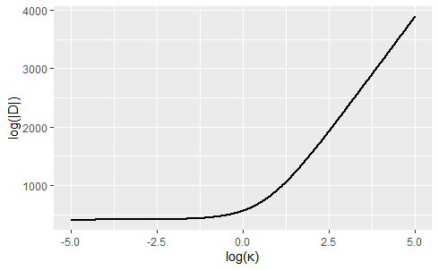

# Implementing latent models driven by NIG noise in Stan

Here we review the framework for extending Gaussian models to models driven with NIG noise and show how to declare these models in Stan using the suite of functions that we developed.

## Framework

Latent Gaussian models are a class of hierarchical models where the latent variable is Gaussian. Their general form is:

$$
\mathbf{y}|\mathbf{x} \sim \pi(\mathbf{y}|\mathbf{x},\mathbf{\theta}_y) \\
 \mathbf{D}(\mathbf{\theta}_\mathbf{x}) \mathbf{x} =  \mathbf{Z}\\
 \mathbf{\theta}_\mathbf{x} \sim \pi(\mathbf{\theta}_\mathbf{x})
$$
where the observations $y_i$ are usually independent given the latent vector $\mathbf{x}$. In the applications we will work on later $\mathbf{\theta}_y$ contains regression coefficients and the vector $\mathbf{\theta}_\mathbf{x}$ usually includes a scale parameter $\sigma$ and a range parameter $\kappa$. The vector $\mathbf{Z}$ is comprised of independent Gaussian noise where $Z_i\sim N(0,h_i)$ and the latent vector $\mathbf{x}$ follows a Gaussian distribution with mean $\mathbf{0}$ and precision matrix $\mathbf{D}^{T}\text{diag}(\mathbf{h})^{-1}\mathbf{D}$. The extension consist in replacing Gaussian noise $\mathbf{Z}$ with non-Gaussian noise $\mathbf{\Lambda}$, which depends on two flexibility parameters that we need to set priors to. The parameter $\eta^\star$ controls the heaviness of the tails, while $\mu^\star$ controls the asymmetry of the noise.

$$
\mathbf{y}|\mathbf{x} \sim \pi(\mathbf{y}|\mathbf{x},\mathbf{\theta}_y) \\
 \mathbf{D}(\mathbf{\theta}_\mathbf{x}) \mathbf{x} =  \mathbf{\Lambda}(\eta^\star,\mu^\star)\\
 \mathbf{\theta}_\mathbf{x} \sim \pi(\mathbf{\theta}_\mathbf{x}) \\
 \eta^\star \sim \text{Exp}(\theta_{\eta^\star})\\
 \mu^\star \sim \text{Laplace}(\theta_{\mu^\star})
$$

## Implementation

We consider in this exampe Gaussian observations given by $\mathbf{y}|\mathbf{x} \sim Normal(\mathbf{B}\boldsymbol{\beta} + \mathbf{x}, \sigma_\epsilon^2\mathbf{I})$, where $\mathbf{B}$ is a design matrix and $\boldsymbol{\beta}$ is a set of regression coefficients. We first start with the Gaussian model:

```{ eval=FALSE}
model{
//observation layer---------------------------
y ~ normal(B*beta + sigma*x, sigmae);
  
//latent field layer--------------------------
x ~ multi_normal_prec(rep_vector(0,N), D'*diag_matrix(1/h)*D)

//prior layer---------------------------------
...
}
```

For the NIG driven model we simply change the declaration of $\mathbf{x}$ as follows in the next code chunk and add the log-likelihoods of the priors for $\eta^\star$ and $\mu^\star$.

```{}
model{
//observation layer---------------------------
y ~ normal(B*beta + sigma*x, sigmae);
  
//latent field layer--------------------------
x ~ modelNIG(D, etas, mus, h, 1)

//prior layer---------------------------------
...
//prior for etas
target += -thetaetas*etas;
//prior for mus
target += -thetamus*fabs(mus);
}
```

When declaring `x ~ modelNIG(...)` the function `modelNIG_lpdf` is called which has the following signature:
```{}
real modelNIG_lpdf(vector x, matrix D, real etas, real mus, vector h, int compute_det)
```

1. x - vector $\mathbf{x}$
2. D - matrix $\mathbf{D}$ which defines the model
3. etas - First flexibility parameter
4. mus - Second flexibility parameter
5. h  - Distance between locations, or area of basis functions.
6. compute_det - Compute log determinant of $\mathbf{D}$ (1) or not (0)
7. Returns - Log-likelihood of the random vector $\mathbf{x}$

The function `modelNIG_lpdf` computes the log of the joint density of $\mathbf{x}$:

\begin{equation}
\log \pi(\mathbf{x|\eta^\star,\mu^\star})= \log|\mathbf{D}| + \sum_{i=1}^n\log\pi_{\Lambda_i(\eta^\star,\mu^\star,h_i)}([\mathbf{D}\mathbf{x}]_i),
(\#eq:logjoint)
\end{equation}

which is given by the the log determinant of $\mathbf{D}$ plus the sum of NIG log-densities.`modelNIG` also allows for within-chain paralellization through the `reduce_sum` function in Stan, which leverages on the fact that each term in the sum can be evaluated separately. To use this feature set  `model$sample(..., threads_per_chain = k)`, where `k` is the number of threads per chain and  `model` is the `CmdStanModel` object.

## Additional functions

### NIG observations

It is also possible to declare independent NIG observations $\mathbf{y}$ with variance $\sigma_\epsilon^2\mathbf{h}$, where typically $\mathbf{h}=\mathbf{1}$ . In the previous example set:

```{}
model{
//observation layer---------------------------
y ~ multi_NIG(B*beta + sigma*x, sigmae, etas_y, mus_y, h);
...
}
```

where `multi_NIG` has signature:
```{}
real multi_NIG_lpdf(vector x, vector mean, real sigma, real etas, real mus, vector h)
```

For the 1D version of the previous density use `y ~ NIG(...)`:

```{}
real NIG_lpdf(real x, real mean, real sigma, real etas, real mus, real h)
```

### Sparse matrix computations

To leverage on the sparsity of $\mathbf{D}$ we also have a function `modelNIG2` which has the following signature:
```{}
real modelNIG2_lpdf(vector X, matrix D, int[] Dv, int[] Du, int[] sizes, 
                     real etas, real mus, vector h, int compute_det)
```
The new arguments are:

1. Dv -  Column indexes for the non-zero values in $\mathbf{D}$
2. Du - Indexes indicating where a given row values start
3. sizes - Array containing number of rows, columns and number non-zero elements of $\mathbf{D}$

The arrays `Dv`, `Du` and `sizes` should be built using Stan's built-in functions for sparse matrix operations which use the compressed row storage. Here is an example where $\mathbf{D}(\kappa)=\kappa^2\text{diag}(\mathbf{h})+\mathbf{G}$:

```{}
transformed data{
  matrix[N,N] Graph = diag_matrix(h) + G;     // Underlying graph (non-zero values of D = kappa^2*C+G)
  int sizew = rows(csr_extract_w(Graph));     // Number of non-zero values of matrix D
  int Dv[size(csr_extract_u(Graph))];         // Collumn indexes (in compressed row storage format)
  int Du[size(csr_extract_u(Graph))];         // Row indexes (in compressed row storage format)
  int sizes[3] = {N, N, sizeW};               // Vector containing number of rows, collumns, and number of non-zero elements in D

  Dv = csr_extract_v(Graph);
  Du = csr_extract_u(Graph);
}
```

## Notes

### Determinant

The matrices $\mathbf{D}$ we will work with either do not depend on a model parameter, are lower triangular or symmetric positive definite. In the first case there is no need to compute the determinant in equation \@ref(eq:logjoint), since Stan does not need proportionality constants. In the second case, the determinant is the product of the diagonal elements. And in the final case we can compute the determinant based on the Cholesky decomposition: $\log|\mathbf{D}|=2\sum_{i=1}^n\log L_{ii}$, where $\mathbf{D} = \mathbf{L} \mathbf{L}^T$ (this is done in  `modelNIG` when setting `compude_det=1`). Computing the log determinant using the Cholesky decomposition can still be slow, and in the first application 60\% of the sampling time was spent computing log determinants. 

We will deal later with matrices $\mathbf{D}$ of the form $\kappa^2\mathbf{C}+\mathbf{G}$ and $\mathbf{I}+\rho\mathbf{W}$, where $\mathbf{C}$ is a diagonal matrix containing the area of the basis functions $h_i$ and $\mathbf{G}$ is a symmetric and real matrix. Consider the eigendecomposition of $\mathbf{C}^{-1}\mathbf{G} =\Gamma \mathbf{V}\Gamma^T$, where $\mathbf{V}=\text{diag}(v_1,\dotsc,v_n)$ is a diagonal matrix containing the eigenvalues of $\mathbf{C}^{-1}\mathbf{G}$. Then:

\begin{align*}
|\kappa^2\mathbf{C}+\mathbf{G}| &= |\mathbf{C}||\kappa^2+\mathbf{C}^{-1}\mathbf{G}|\\
&= |\mathbf{C}||\Gamma(\kappa^2 \mathbf{I} + \mathbf{V})\Gamma^T|
&= |\mathbf{C}||\mathbf{\Gamma}||\kappa^2\mathbf{I}+\mathbf{V}||\Gamma^T|
&= \prod_{i=1}^n h_i(\kappa^2+v_i)
\end{align}

Therefore $\log |\kappa^2\mathbf{C}+\mathbf{G}| \propto \sum_{i=1}^n\log(\kappa^2+v_i)$, and one can compute the eigenvalues $v_i$ only once before the HMC algorithm starts, and then evaluate $\log \mathbf{D}$ efficiently using the previous result. similar transformations can be applied when computing the determinant of $\mathbf{D} = \mathbf{I}+\rho\mathbf{W}$, where now  $\log \mathbf{D}=\sum_{i=1}^n\log(1-\rho v_i)$, where $v_i$ are the eigenvalues of $\mathbf{W}$.

<!--This can be dropped to less than 1\% by precomputing $\log|\mathbf{D}(\kappa)|$ for many values of $\kappa$ and then during sampling time finding the log determinant by interpolation. The determinant of matrices $\mathbf{D}$ of the type $\mathbf{D}(\kappa) = \kappa^2\text{diag}(\mathbf{h}) + \mathbf{G}$  behaves linearly for small or large $\kappa$ in Log-Log scale, for the applications we will work with. 

```{r eval=FALSE, include=FALSE}
library(ggplot2)
ggplot(data=data.frame(x=kappa_log, y = det_log), aes(x=x, y=y)) + geom_line(lwd=1) + xlab('log(κ)') + ylab('log(|D|)')
```

```{r, out.width = '75%', fig.cap="Determinant of $D=\\kappa^2 diag(h) + G$ in Application ?? "}

```

So we can do linear interpolation in the middle region, and linear extrapolation outside. The function `interpolation` does this and has signature:

```{}
real interpolation(real x, vector x0, vector y0)
```
-->

### Non-centered parameterization

A non-centered parameterization takes advantage of the fact that:

```{}
model{
//observation layer---------------------------
y ~ normal(B*beta + x, sigmae);
//latent field layer--------------------------
x ~ modelNIG(D/sigma, etas, mus, h, 1);
}
```

is equivalent to
```{}
model{
//observation layer---------------------------
y ~ normal(B*beta + sigma*inverse(D)*Lambda, sigmae);
//latent field layer--------------------------
Lambda ~ multiNIG(rep_vector(0,N), 1, etas, mus, h);
}
```

where `multi_NIG` wields a vector of independent NIG noise. Both parameterizations are equal in distribution, but the latter enjoys a nicer posterior geometry when the likelihood function is relatively diffuse, by removing explicit hierarchical correlations. This parameterization often leads to more efficient inference and it is discussed in @betancourt2015hamiltonian for latent Gaussian models in Stan, and can also be found in @stan and @bet2020. `inverse(D)*Lambda` can be more efficiently implemented using `mdivide_left_spd(D,Lambda)` or `mdivide_left_tri_low(D,Lambda)` if $\mathbf{D}$ is symmetric positive definite or lower triangular. However in application ?? the effective sample sizes using a full non-centered parameterization was about 40% of the ess using `modelNIG`, due to the need of solving $\mathbf{D}\mathbf{x}=\mathbf{\Lambda}$ for $\mathbf{x}$ at every iteration. Though, this parameterization is worth keeping in mind, in case diagnostics reveal poor convergencence or exploration by the HMC algorithm. We remind the reader that the precision or covariance matrices do not uniquely specify $\mathbf{x}$ when the driving noise is a NIG distribution, which limits the transformations we can do for computational efficiency.

SOLVE DX=LAMBDA using stan solver...


### Heavy-tailed distributions and Stan

The NIG distribution converges to a Gaussian distribution when $\eta\to0$ and to a Cauchy distribution when $\eta\to\infty$. The large extent of the heavy tails of the Cauchy distribution can be problematic in statistical computation. As described in @bet2018 and @stan the step size should be relatively large in the tail compared to the trunk, in order to explore the massive extend of the tails in a reasonable amount of time. However, with a large step size there will be too much rejection in the central region of the distribution.

The PC prior for $\eta$ helps mitigate this issue because it penalizes heavy tails and shrinks the NIG distribution towards to base Gaussian model. Nonetheless, when the NIG distribution is close to the Cauchy limit it may be better to use representation in eq. \@ref(eq:framework) where we use the fact that $\mathbf{x}|\mathbf{V}$ is Gaussian. Still, by declaring the models with the function `modelNIG` (which uses the NIG density) sampling times that used to take hours with the conditional Gaussian representation of eq. \@ref(eq:framework), now take minutes, as will be shown in the next section.


LAPLACE APPROXIMATION talk about it...
worth exploring approximation techniques that relate the observations y to eta and mu directly without the need for latent variables


Comparing implementations

AR1 processes with etas=5 and mus=2

First see if reduce_sum works... for RW1... and then AR1...

6. X|V representation
1. modelNIG 
2. modelNIG2 with with chain paralelization
3. modelNIG2 with with within-chain paralelization and VB algorihtm

more:
4. try non-centered parameterization with and without algebraic solver
5. try using independent prior transformation
6. y|V approximation

Make now all the functions in a function file...

Deal now with SPDE application write take things from Adam Walder and Bolin paper... and try just temperature and also VB algorithm just check if no better then remove...

